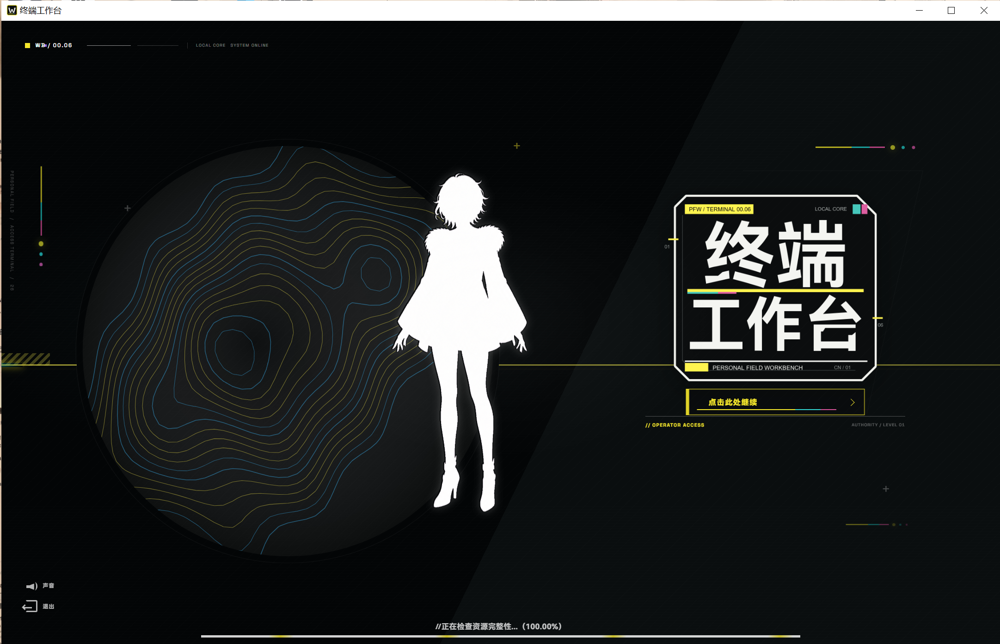
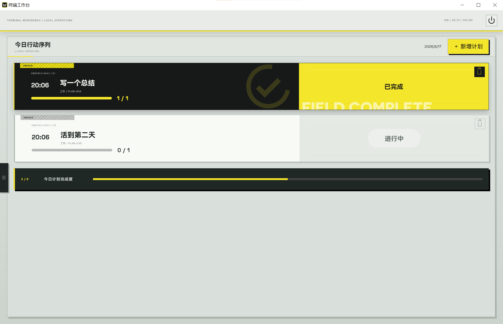
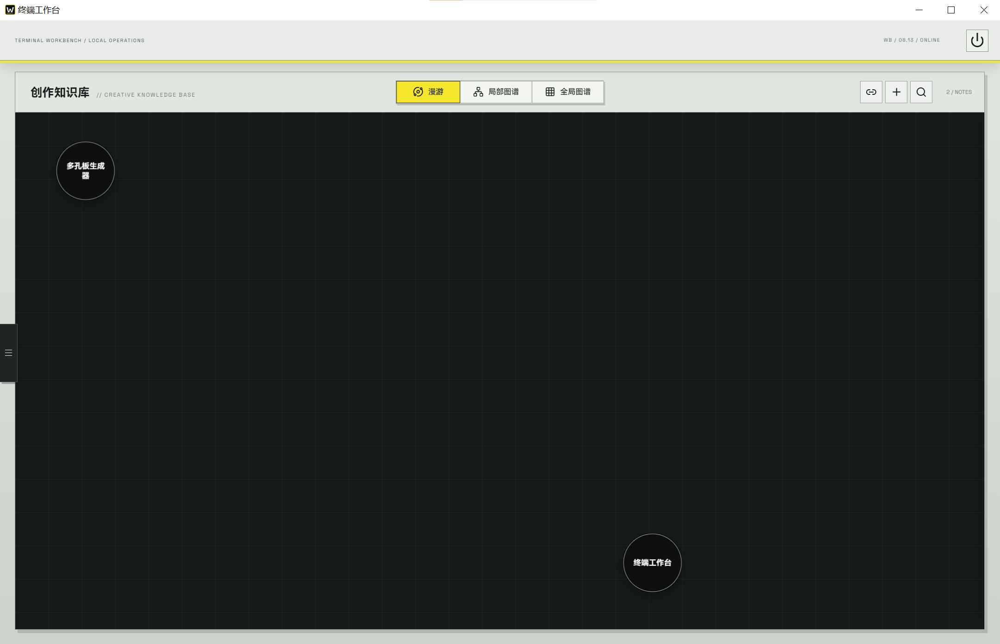
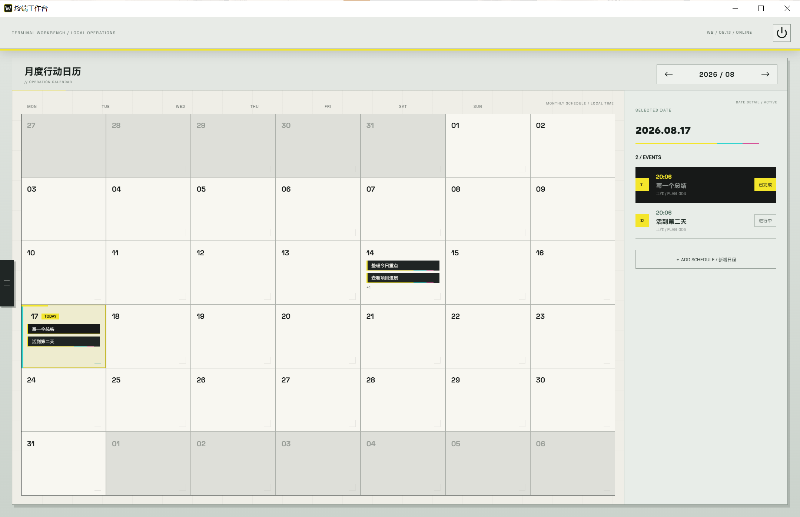

<p align="right">
  <strong>简体中文</strong> · <a href="README_EN.md">English</a>
</p>

# 终端工作台

<p align="center">
  
</p>

终端工作台是一款受《明日方舟：终末地》视觉语言启发的 Windows 本机项目工作区。它以可漫游、关联、衰减并转化为项目的「忆泡」组织灵感，同时将 Codex 对话、后台任务、项目画布、今日计划、日历和本机工具整合在同一个桌面应用中。

当前版本：`0.2.7`

维护者：[@fanshichengshicheng](https://github.com/fanshichengshicheng)

## 下载安装

<p align="center">
  <a href="https://github.com/fanshichengshicheng/terminal-workbench/releases/download/v0.2.7/terminal-workbench_0.2.7_x64-setup.exe"><strong>下载 Windows x64 安装包（v0.2.7）</strong></a>
  <br />
  <a href="https://github.com/fanshichengshicheng/terminal-workbench/releases/latest">查看最新版本与更新说明</a>
</p>

> 安装程序目前尚未进行数字签名，Windows 可能会显示安全提醒。

## 核心特色：忆泡

「忆泡」是终端工作台组织灵感与项目的核心方式，而不只是另一种笔记列表。

- 在漫游视图中让灵感以忆泡形式自由漂浮，形成更直观的创作空间
- 为相关笔记建立连线，并在局部图谱与全局图谱中查看知识关系
- 长期未访问的忆泡会逐渐休眠或沉降，也可以固定重要内容避免衰减
- 将成熟的灵感直接转化为项目工作区，继续使用画布与 Codex 推进工作

## 设计说明

本项目尝试参考并复现《明日方舟：终末地》的视觉设计语言，是一次非官方的个人风格化实践。最终呈现或许没有做到完全还原，但从配色、排版到交互细节都已经尽力打磨。

本项目与鹰角网络及《明日方舟：终末地》官方无关。

## 界面预览

### 启动界面



<table>
  <tr>
    <td width="50%">
      <strong>今日计划</strong><br />
      
    </td>
    <td width="50%">
      <strong>知识图谱画布</strong><br />
      
    </td>
  </tr>
  <tr>
    <td colspan="2">
      <strong>月度日历</strong><br />
      
    </td>
  </tr>
</table>

## 主要功能

- 以忆泡管理灵感，支持漫游、关联、记忆衰减和项目转化
- 多项目工作区与独立项目目录
- 本机 Codex 对话、流式回复、命令执行、文件修改与审批
- 后台任务中心，离开项目页面后任务仍可继续
- 画布文字、图片、回复卡片、自由涂鸦和节点连线
- 聊天图片附件、历史图片回显和操作记录折叠
- 创作知识库、局部与全局关系图谱、今日计划与月历同步
- Windows 应用、快捷方式、脚本、网址和文件夹快捷启动
- API Key 使用 Windows Credential Manager 保存，不写入项目文件

## 系统要求

- Windows 10/11 x64
- Node.js `>=22.13.0`
- pnpm
- Rust 与 Tauri 2 所需的 Windows 构建工具（仅从源码构建时需要）

## 本地开发

```powershell
pnpm install
pnpm desktop:dev
```

只运行网页界面：

```powershell
pnpm desktop:web:dev
```

## 构建 Windows 安装包

```powershell
pnpm install
pnpm desktop:build
```

安装包输出到：

```text
src-tauri/target/release/bundle/nsis/
```

构建前，`scripts/prepare-codex-sidecar.mjs` 会从已安装的官方 `@openai/codex` npm 依赖中准备 Windows Codex 运行时。`src-tauri/resources/` 是生成目录，不进入 Git 仓库。

## 数据与隐私

- 项目、计划、笔记与画布数据保存在本机浏览器存储或 IndexedDB 中。
- 第三方模型 API Key 在桌面版中保存到 Windows Credential Manager。
- `.env`、本机日志、构建缓存、Codex 运行时二进制和个人文档均由 `.gitignore` 排除。

## 验证

```powershell
pnpm exec eslint app/ProjectWorkspace.tsx app/codex-client.ts app/codex-runtime.ts
pnpm desktop:web:build
cargo check --manifest-path src-tauri/Cargo.toml
```

## 发布

`0.2.7` 的变更说明见 [RELEASE_NOTES.md](RELEASE_NOTES.md)。

本仓库当前未附带开源许可证；公开源码不等同于授予再分发或商业使用许可。
